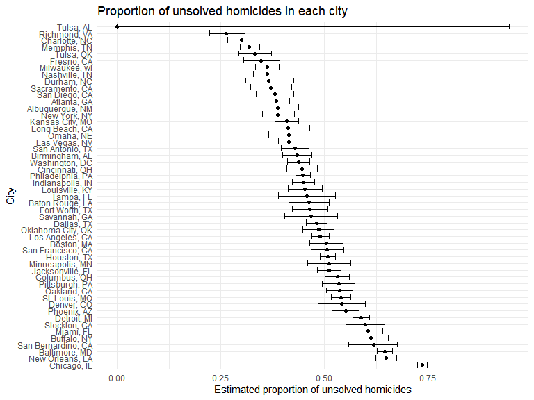
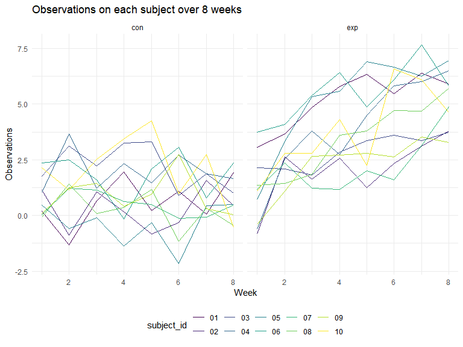
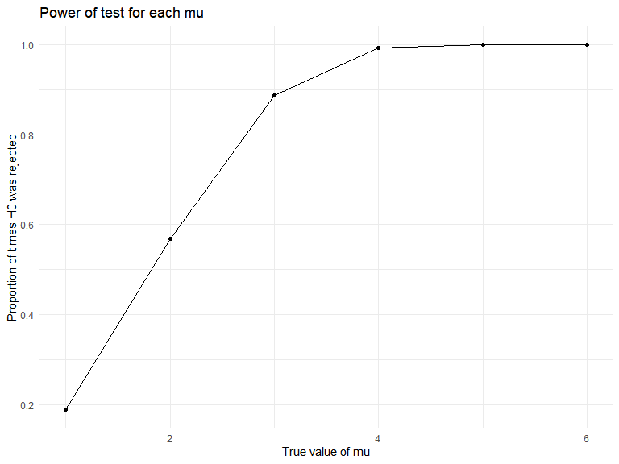
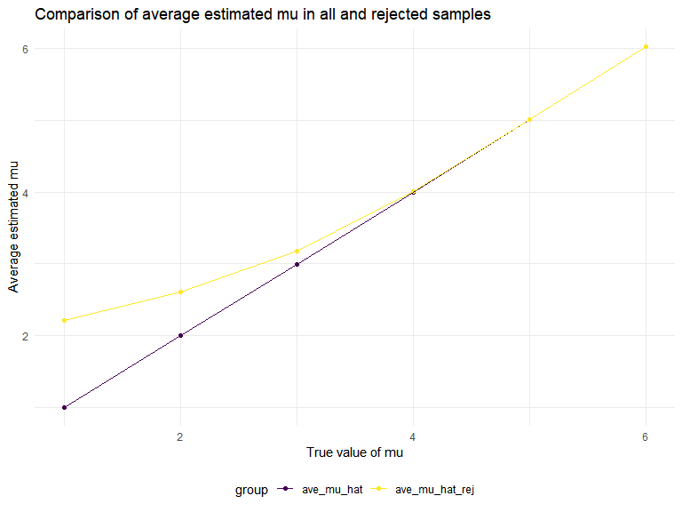

p8105_hw5_yb2591
================
Yige Bian (yb2591)
2023-11-15

## Problem 1

``` r
homicide_data = read_csv("./data/homicide-data.csv") |> 
  janitor::clean_names()
```

    ## Rows: 52179 Columns: 12
    ## ── Column specification ────────────────────────────────────────────────────────
    ## Delimiter: ","
    ## chr (9): uid, victim_last, victim_first, victim_race, victim_age, victim_sex...
    ## dbl (3): reported_date, lat, lon
    ## 
    ## ℹ Use `spec()` to retrieve the full column specification for this data.
    ## ℹ Specify the column types or set `show_col_types = FALSE` to quiet this message.

``` r
homicide_data
```

    ## # A tibble: 52,179 × 12
    ##    uid        reported_date victim_last  victim_first victim_race victim_age
    ##    <chr>              <dbl> <chr>        <chr>        <chr>       <chr>     
    ##  1 Alb-000001      20100504 GARCIA       JUAN         Hispanic    78        
    ##  2 Alb-000002      20100216 MONTOYA      CAMERON      Hispanic    17        
    ##  3 Alb-000003      20100601 SATTERFIELD  VIVIANA      White       15        
    ##  4 Alb-000004      20100101 MENDIOLA     CARLOS       Hispanic    32        
    ##  5 Alb-000005      20100102 MULA         VIVIAN       White       72        
    ##  6 Alb-000006      20100126 BOOK         GERALDINE    White       91        
    ##  7 Alb-000007      20100127 MALDONADO    DAVID        Hispanic    52        
    ##  8 Alb-000008      20100127 MALDONADO    CONNIE       Hispanic    52        
    ##  9 Alb-000009      20100130 MARTIN-LEYVA GUSTAVO      White       56        
    ## 10 Alb-000010      20100210 HERRERA      ISRAEL       Hispanic    43        
    ## # ℹ 52,169 more rows
    ## # ℹ 6 more variables: victim_sex <chr>, city <chr>, state <chr>, lat <dbl>,
    ## #   lon <dbl>, disposition <chr>

The raw data `homicide_data` gathered data on homicides in 50 large U.S.
cities and contains 52179 observations and 12 variables. Variables
include date, information of location and victims.

The following table shows the total number of homicide and unsolved
number of homicide in 51 cities

``` r
# Create "city_state" and summarize
homicide_data =
homicide_data |>
  mutate(city_state = str_c(city,state,sep = ", "))

city_state_sum = homicide_data |>
  group_by(city_state) |>
  summarize(
    all_homicides = n(),
    unsolved_homicides = sum(disposition %in% c("Closed without arrest","Open/No arrest")))

city_state_sum
```

    ## # A tibble: 51 × 3
    ##    city_state      all_homicides unsolved_homicides
    ##    <chr>                   <int>              <int>
    ##  1 Albuquerque, NM           378                146
    ##  2 Atlanta, GA               973                373
    ##  3 Baltimore, MD            2827               1825
    ##  4 Baton Rouge, LA           424                196
    ##  5 Birmingham, AL            800                347
    ##  6 Boston, MA                614                310
    ##  7 Buffalo, NY               521                319
    ##  8 Charlotte, NC             687                206
    ##  9 Chicago, IL              5535               4073
    ## 10 Cincinnati, OH            694                309
    ## # ℹ 41 more rows

``` r
bal_MD = city_state_sum |>
  filter(city_state == "Baltimore, MD")

bal_proptest = prop.test(
    x = pull(bal_MD, unsolved_homicides),
    n = pull(bal_MD, all_homicides)) |>
  broom::tidy()

bal_proptest |>
  select(estimate,conf.low, conf.high)
```

    ## # A tibble: 1 × 3
    ##   estimate conf.low conf.high
    ##      <dbl>    <dbl>     <dbl>
    ## 1    0.646    0.628     0.663

The estimated proportion of unsolved homicides in Baltimore, MD is
0.6455607. The confidence interval is (0.6275625, 0.6631599)

The following table shows the proportion of unsolved homicides and
confidence intervals for each city

``` r
# prop.test for all cities
all_city_proptest = city_state_sum |> 
  mutate(
    all_proptest = 
      map2(
        unsolved_homicides, all_homicides, \
        (un, all) prop.test(x = un,n = all)),
      tidy_proptest = map(all_proptest, broom::tidy)) |> 
  unnest(tidy_proptest) |> 
  select(city_state,estimate,conf.low, conf.high)

all_city_proptest
```

    ## # A tibble: 51 × 4
    ##    city_state      estimate conf.low conf.high
    ##    <chr>              <dbl>    <dbl>     <dbl>
    ##  1 Albuquerque, NM    0.386    0.337     0.438
    ##  2 Atlanta, GA        0.383    0.353     0.415
    ##  3 Baltimore, MD      0.646    0.628     0.663
    ##  4 Baton Rouge, LA    0.462    0.414     0.511
    ##  5 Birmingham, AL     0.434    0.399     0.469
    ##  6 Boston, MA         0.505    0.465     0.545
    ##  7 Buffalo, NY        0.612    0.569     0.654
    ##  8 Charlotte, NC      0.300    0.266     0.336
    ##  9 Chicago, IL        0.736    0.724     0.747
    ## 10 Cincinnati, OH     0.445    0.408     0.483
    ## # ℹ 41 more rows

``` r
# Plot to show the eatimates and Cls for each city
all_city_proptest |> 
  ggplot(aes(x = reorder(city_state,-estimate), y = estimate))+
  geom_point()+
  geom_errorbar(
    aes(
      ymin = conf.low,
      ymax = conf.high))+
  coord_flip()+
  labs(
    title = "Proportion of unsolved homicides in each city",
    x = "City",
    y = "Estimated proportion of unsolved homicides")
```


The plot above shows the estimates and CIs for each city, Tulsa, AL has
the lowest estimate and the Chicago, IL has the highers estimate.

## Problem 2

``` r
# read data for problem2
p2_df = tibble(file = list.files(path = "data/p2_data", full.names = TRUE, pattern=".csv"))

p2_df = p2_df |>
  mutate(data = map(file, read.csv))

p2_df
```

    ## # A tibble: 20 × 2
    ##    file                    data        
    ##    <chr>                   <list>      
    ##  1 data/p2_data/con_01.csv <df [1 × 8]>
    ##  2 data/p2_data/con_02.csv <df [1 × 8]>
    ##  3 data/p2_data/con_03.csv <df [1 × 8]>
    ##  4 data/p2_data/con_04.csv <df [1 × 8]>
    ##  5 data/p2_data/con_05.csv <df [1 × 8]>
    ##  6 data/p2_data/con_06.csv <df [1 × 8]>
    ##  7 data/p2_data/con_07.csv <df [1 × 8]>
    ##  8 data/p2_data/con_08.csv <df [1 × 8]>
    ##  9 data/p2_data/con_09.csv <df [1 × 8]>
    ## 10 data/p2_data/con_10.csv <df [1 × 8]>
    ## 11 data/p2_data/exp_01.csv <df [1 × 8]>
    ## 12 data/p2_data/exp_02.csv <df [1 × 8]>
    ## 13 data/p2_data/exp_03.csv <df [1 × 8]>
    ## 14 data/p2_data/exp_04.csv <df [1 × 8]>
    ## 15 data/p2_data/exp_05.csv <df [1 × 8]>
    ## 16 data/p2_data/exp_06.csv <df [1 × 8]>
    ## 17 data/p2_data/exp_07.csv <df [1 × 8]>
    ## 18 data/p2_data/exp_08.csv <df [1 × 8]>
    ## 19 data/p2_data/exp_09.csv <df [1 × 8]>
    ## 20 data/p2_data/exp_10.csv <df [1 × 8]>

``` r
# clean and tidy the df
tidy_p2_df = p2_df |>
  mutate(
    file = gsub('data/p2_data/', '', file),
    file = gsub('.csv', '', file)) |>
  separate(col = file, into = c('arm', 'subject_id'), sep = '_') |>
  unnest(data) |>
  pivot_longer(
    cols = starts_with("week"),
    names_to = "week",
    values_to = "data") |>
  mutate(week = as.numeric(gsub('week_', '', week)))

tidy_p2_df
```

    ## # A tibble: 160 × 4
    ##    arm   subject_id  week  data
    ##    <chr> <chr>      <dbl> <dbl>
    ##  1 con   01             1  0.2 
    ##  2 con   01             2 -1.31
    ##  3 con   01             3  0.66
    ##  4 con   01             4  1.96
    ##  5 con   01             5  0.23
    ##  6 con   01             6  1.09
    ##  7 con   01             7  0.05
    ##  8 con   01             8  1.94
    ##  9 con   02             1  1.13
    ## 10 con   02             2 -0.88
    ## # ℹ 150 more rows

``` r
# plot spaghetti
tidy_p2_df |> 
  ggplot(aes(x=week, y=data, color=subject_id)) +
  geom_line()+
  facet_grid(~arm)+
  labs(
    title="Observations on each subject over 8 weeks",
    x="Week",
    y="Observations"
    )
```


The plot shows that observations in control arm have comparatively
stable fluctuations, while observations in experimental arm have obvious
increase from week 1 to week 8.

## Problem 3

``` r
# fix sample size and sigma, set the seed
n = 30
sigma = 5
set.seed(1)
```

``` r
# write the function to give mu_hat and p value
sim_mean_p = function(n, mu, sigma) {
  
  sim_data = rnorm(n, mean = mu, sd = sigma)

  result = tibble(
    mu_hat = mean(sim_data),
    p_value = pull(broom::tidy(t.test(sim_data, alternative = "two.sided", mu= 0, config.level = 0.95)),p.value)
  )}
```

The following table shows the mu_hat and p_value for 5000 iterated
datasets of the model with mean of 0.

``` r
sim_results_df = 
  expand_grid(
    iter = 1:5000
  ) |> 
  mutate(
    estimate_df = map(1:5000, \(i) sim_mean_p(n, 0, sigma))
  ) |> 
  unnest(estimate_df)
sim_results_df
```

    ## # A tibble: 5,000 × 3
    ##     iter mu_hat p_value
    ##    <int>  <dbl>   <dbl>
    ##  1     1  0.412  0.629 
    ##  2     2  0.664  0.368 
    ##  3     3  0.551  0.534 
    ##  4     4  0.567  0.487 
    ##  5     5 -1.65   0.0599
    ##  6     6  1.19   0.229 
    ##  7     7  0.334  0.738 
    ##  8     8 -1.19   0.209 
    ##  9     9  0.122  0.887 
    ## 10    10  0.684  0.472 
    ## # ℹ 4,990 more rows

The following table shows the mu_hat and p_value for 30000 iterated
datasets (5000 for each value of mu) of the model with mean of 1, 2, 3,
4, 5, 6.

``` r
sim_allmu_results_df = 
  expand_grid(
    mu = c(1, 2, 3, 4, 5, 6),
    iter = 1:5000
    ) |> 
  mutate(
    estimate_df = map(mu, \(m) sim_mean_p(n, m, sigma))
  ) |> 
  unnest(estimate_df)

sim_allmu_results_df
```

    ## # A tibble: 30,000 × 4
    ##       mu  iter mu_hat p_value
    ##    <dbl> <int>  <dbl>   <dbl>
    ##  1     1     1  1.52   0.0865
    ##  2     1     2  2.11   0.0159
    ##  3     1     3  2.01   0.0183
    ##  4     1     4  0.165  0.839 
    ##  5     1     5  0.108  0.912 
    ##  6     1     6  1.56   0.0682
    ##  7     1     7  2.04   0.0252
    ##  8     1     8  2.40   0.0154
    ##  9     1     9  2.15   0.0154
    ## 10     1    10  0.500  0.634 
    ## # ℹ 29,990 more rows

``` r
sim_allmu_results_df |>
  mutate(if_rejected = p_value < 0.05) |>
  group_by(mu) |>
  summarize(total_rej = sum(if_rejected)) |>
  mutate(rej_prop = total_rej/5000) |>
  ggplot(aes(x = mu, y = rej_prop)) +
  geom_point() +
  geom_line() +
  labs(
    title="Power of test for each mu",
    x="True value of mu",
    y="Proportion of times H0 was rejected"
    )
```


The plot shows that the power of test increases as the increase of true
value of mu.

``` r
ave_mu_hat_all = sim_allmu_results_df |>
  group_by(mu) |>
  summarize(ave_mu_hat = mean(mu_hat))

ave_mu_hat_rej = sim_allmu_results_df |>
  filter(p_value < 0.05) |>
  group_by(mu) |>
  summarize(ave_mu_hat_rej = mean(mu_hat))

ave_mu_hat = left_join(ave_mu_hat_all, ave_mu_hat_rej, by = "mu")

ave_mu_hat |>
  pivot_longer(
    ave_mu_hat:ave_mu_hat_rej,
    names_to = "group",
    values_to = "mean") |>
  ggplot(aes(x = mu, y = mean, color = group)) + geom_point() +
  geom_line() +
  labs(
    title="Comparison of average estimated mu in all and rejected samples",
    x="True value of mu",
    y="Average estimated mu"
    ) 
```



The plot show the average estimate of mu_hat and the true value of mu
for all samples and samples which null hypothesis was rejected.

We observed that the average estimated mean is larger in samples for
which the null was rejected, this happened because sample means tend to
be larger to be rejected, so when we consider samples for which the null
was rejected, the average estimate of mu_hat tend to be larger.
